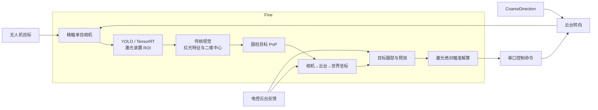

# WIT Radar

> 面向 RoboMaster 无人机目标的低成本纯视觉定位、激光检测装置识别与云台瞄准方案。

## 项目简介

`WIT Radar` 尝试用**纯视觉**完成无人机目标的发现、精定位和云台瞄准，**不依赖激光雷达**。系统可由一到两个单目相机构成，适合经费资源有限、但希望尝试无人机识别与激光瞄准方案的队伍。

当前方案中，短焦相机负责发现无人机并向云台提供大致方向；云台将精瞄相机转至目标区域后，程序先通过神经网络确定激光检测装置的 ROI，再以传统视觉提取红光特征、计算装置中心，并进一步完成 PnP、坐标变换、跟踪预测和瞄准解算。

由于本人一直是调视觉的，所以代码的预测部分的核心逻辑都参考自开源自瞄代码

## 方案亮点

- **低成本纯视觉**：以单目相机为核心，不要求激光雷达等高成本传感器；可按资源选择单相机或双相机方案。
- **神经网络与传统视觉结合**：神经网络负责在复杂画面中缩小搜索范围，传统视觉负责红光中心和几何特征的精细计算，便于观察、调参与排错。
- **完整精瞄链路**：覆盖海康相机取图、TensorRT ROI 检测、红光特征提取、圆柱目标 PnP、坐标变换、目标跟踪、云台延迟预测和串口通信。
- **考虑机械误差**：提供激光光轴标定工具，用于减小相机、激光器和云台安装误差带来的影响。
- **便于拆分复用**：相机、通信、检测、几何和跟踪模块相互独立，可按项目需要替换或裁剪。

## 系统方案



### 精瞄数据流

```text
工业相机图像
  → TensorRT 检测激光装置 ROI
  → HSV / 连通域 / 分层分组提取红光方块
  → 双环圆柱几何 PnP 求目标中心
  → 相机坐标系、云台坐标系、世界坐标系转换
  → 观测质量评估、卡尔曼式跟踪与运动预测
  → 考虑云台到位时间和激光外参的绝对 yaw / pitch 解算
  → 串口发送控制指令
```

## 当前状态与边界

本项目仍在持续开发，代码中存在许多与当前设备、目标尺寸和调参结果相关的假设。它更适合作为实现思路、调试工具和后续开发的基础，而不是开箱即用的通用解决方案。

- 相机内参、手眼外参、激光外参、目标尺寸和 HSV 阈值都必须按实际设备重新标定或调整。
- 模型权重会在整理后发出
- 粗定位相机、无人机检测模型与云台协同策略会因整车方案不同而变化。
- 预测与跟踪逻辑主要参考 RoboMaster 自动瞄准领域的开源思路；其效果仍需结合实际时延、云台性能和目标运动进行验证。

## 运算平台

## 硬件

## 环境依赖

| 类别 | 当前要求 |
| --- | --- |
| 操作系统 | Ubuntu22.04 |
| 编译工具 | 支持 C++17 的编译器、CMake >= 3.16 |
| 图像处理 | OpenCV（`core`、`imgproc`、`calib3d`、`dnn`、`highgui`、`video`） |
| 推理 | CUDA Runtime、TensorRT |
| 相机 SDK | Hikrobot MVS SDK |

## 构建与运行

### 1. 准备配置与模型

运行前检查 `config/laser.json`：

- `camera`：相机序列号、图像尺寸、内参和畸变参数；
- `handeye`：相机到云台的旋转与平移；
- `pnp`：激光检测装置的实际尺寸；
- `laser`：激光光束相对相机的安装关系；
- `detector.engine`：本机生成的 TensorRT 引擎路径，默认 `model/best.engine`；
- `communication.serial`：电控串口参数。

配置内的参数对应当前设备，使用前请务必按自己的设备修改和标定。

### 2. 配置与编译

```bash
cmake -B build
make -C build -j`nproc`
```

### 3. 运行主程序

```bash
# 运行检测、定位和瞄准链路；默认不主动向电控发送瞄准命令
./build/laser/laser_aim

# 仅在完成安全检查后，才允许实际写入串口
./build/laser/laser_aim --send
```

> ⚠️ `--send` 会向配置的串口发送云台命令。请先完成离线测试、限位检查和现场安全确认。

## 目录与文件说明

### 根目录

| 文件 / 目录 | 作用 |
| --- | --- |
| `CMakeLists.txt` | 项目构建入口，组织相机、通信、激光检测和测试模块。 |
| `README.md` | 项目总览、构建方式和使用说明。 |
| `config/` | 运行、标定和传统视觉测试所用 JSON 配置。 |
| `camera/` | 海康工业相机封装。 |
| `communication/` | 串口协议、云台状态、坐标变换和瞄准解算。 |
| `laser/` | 激光装置检测、传统视觉、PnP、观测与跟踪主链路。 |
| `test/` | 离线验证、通信验证与标定工具。 |
| `model/` | 公开模型权重 |

### `camera/`：相机模块

| 文件 | 作用 |
| --- | --- |
| `camera/CMakeLists.txt` | 查找 Hikrobot MVS SDK，构建 `hik_camera` 库。 |
| `camera/hik_camera.hpp` | 定义相机帧时间戳与 `HikCamera` 接口。 |
| `camera/hik_camera.cpp` | 使用 MVS SDK 枚举、按序列号打开设备并采集 OpenCV 图像。 |

### `communication/`：通信、坐标与瞄准模块

| 文件 | 作用 |
| --- | --- |
| `communication/CMakeLists.txt` | 构建 `robot_communication` 库并链接 Boost 与 OpenCV。 |
| `serial_driver.hpp/.cpp` | 基于 Boost.Asio 的异步串口读写与错误处理。 |
| `robot_protocol.hpp/.cpp` | 电控状态帧与视觉控制帧的编码、解码及字节布局。 |
| `robot_communicator.hpp/.cpp` | 连接串口驱动和协议层，对外提供云台状态回调与命令发送接口。 |
| `gimbal_state_history.hpp/.cpp` | 保存短时间窗口内的云台状态，并按观测时间查找或插值。 |
| `gimbal_timestamp_mapper.hpp/.cpp` | 将电控时间戳映射到上位机单调时钟，用于时序对齐。 |
| `gimbal_arrival_time.hpp/.cpp` | 根据云台速度、加速度约束估计到达目标角度的时间。 |
| `coordinate_transformer.hpp/.cpp` | 加载手眼标定参数，实现相机、云台和世界坐标系转换。 |
| `aim_solver.hpp/.cpp` | 根据世界坐标目标、云台姿态和激光光束外参计算绝对 yaw / pitch。 |

### `laser/`：检测、定位与跟踪模块

| 文件 | 作用 |
| --- | --- |
| `laser/CMakeLists.txt` | 查找 TensorRT、CUDA 与 OpenCV，构建检测库和运行入口。 |
| `laser_detector.hpp/.cpp` | 加载 TensorRT 引擎，完成图像预处理、YOLO 推理、NMS 与 ROI 映射。 |
| `device_center_finder.hpp/.cpp` | 在 ROI 内进行 HSV 阈值、形态学处理、连通域筛选和分层分组，求传统视觉二维中心。 |
| `keypoint_center_finder.hpp/.cpp` | 可选的 ONNX 关键点中心网络及其与传统结果的融合。 |
| `cylinder_pose_solver.hpp/.cpp` | 根据红光方块角点和双环圆柱几何求解目标三维姿态与中心。 |
| `static_aim_compensation.hpp/.cpp` | 按距离对瞄准角进行经验静态补偿。 |
| `world_target_observation.hpp/.cpp` | 将 PnP、云台状态与误差指标组织为可供跟踪器使用的世界坐标观测。 |
| `world_target_tracker.hpp/.cpp` | 维护目标状态，进行观测门限、初始化、预测、更新和失观测滑行。 |
| `laser_aim.cpp` | 主运行入口：取图、检测、PnP、坐标转换、跟踪、瞄准与可选串口发送。 |
| `test_laser.cpp` | 相机、ROI 检测与红光定位链路的交互式验证程序。 |
| `KEYPOINT_CENTER_MODEL.md` | 关键点中心网络的输入、输出和运行说明。 |
| `laser/README.md` | 激光检测、PnP 尺寸与激光安装参数的补充说明。 |

### `config/`、`docs/` 与 `model/`

| 文件 | 作用 |
| --- | --- |
| `config/laser.json` | 主程序配置：相机、标定、目标尺寸、检测、跟踪、串口与控制参数。 |
| `config/test.json` | `test_traditional_center` 的离线 / 实时传统视觉测试配置。 |

### `test/`：测试与标定工具

| 文件 | 验证内容 |
| --- | --- |
| `test_hik_camera.cpp` | 海康相机枚举、连接与取图。 |
| `test_laser_model.cpp` | TensorRT 模型输入、检测框和 ROI 映射。 |
| `test_device_center.cpp` | 单张 ROI 的红光二维中心提取。 |
| `test_traditional_center.cpp` | 完整传统视觉流水线的可视化与参数调试。 |
| `test_cylinder_pose.cpp` | 单张 ROI 的红光方块角点与圆柱 PnP 结果。 |
| `test_cylinder_pose_solver.cpp` | 圆柱 PnP 求解器的单元级验证。 |
| `test_world_target_observation.cpp` | PnP、云台状态和不确定度到世界观测的构建。 |
| `test_world_target_tracker.cpp` | 世界坐标目标的初始化、更新、预测和失观测逻辑。 |
| `test_static_aim_compensation.cpp` | 距离相关静态瞄准补偿。 |
| `test_coordinate_transformer.cpp` | 相机、云台与世界坐标变换链路。 |
| `test_absolute_laser_aim.cpp` | 激光外参参与的绝对瞄准角计算。 |
| `test_robot_protocol.cpp` | 串口帧长度、字段编码与角度约定。 |
| `test_robot_communication.cpp` | 实际串口的云台状态接收和命令发送。 |
| `test_gimbal_state_history.cpp` | 云台状态历史缓存与查找。 |
| `test_gimbal_timestamp_mapper.cpp` | 电控时间戳到主机时间的映射。 |
| `test_gimbal_arrival_time.cpp` | 云台运动与到位时间预测。 |
| `calibrate_laser_boresight.cpp` | 激光光轴标定数据采集与求解。 |
| `test/CMakeLists.txt` | 上述测试与标定目标的构建定义。 |
| `test/README.md` | 各离线测试的参数和运行示例。 |

## 常用测试命令

```bash
# 验证 TensorRT 检测模型输出
./build/test/test_laser_model <image_path>

# 可视化传统视觉流程
./build/test/test_traditional_center config/test.json

```


## 标定与坐标约定

- 详细的激光光轴标定流程见 `docs/red_laser_boresight_calibration.md`。
- 串口字节布局与控制字段见 `docs/serial_protocol.md`。
- 运动目标的观测时间、预测和云台到位时间设计见 `docs/motion_target_timing.md`。
- 相机坐标遵循 OpenCV 约定：`+X` 指向图像右侧、`+Y` 指向图像下侧、`+Z` 指向镜头前方。
- 所有长度统一使用米；配置、模型和标定参数必须对应同一套相机、镜头、目标装置与安装关系。

# 作者

- 费钰涵 [AuroraFYH](https://github.com/AuroraFYH) 
  除模型训练外其他所有部分

- 郝雅蓉
  数据集制作和模型训练

---

## 参考文献
- 武汉科技大学 崇实 战队

  [awakening](https://github.com/WUST-RM/awakening)

  [wust_vision](https://github.com/WUST-RM/wust_vision)

- 同济大学 superpower 战队  

  [sp_vision_25](https://github.com/TongjiSuperPower/sp_vision_25)

- 华北理工大学 Horizon 战队  

  https://github.com/BreCaspian/LaserTracking-2026

- 香港科技大学 ENTERPRIZE 战队  

  [RM2025-Radar-Algorithm](https://github.com/hkustenterprize/RM2025-Radar-Algorithm)


# 🙏 对本项目有帮助的 RoboMaster 开源项目或者个人

排名不分先后。

- 武汉科技大学 崇实 战队

- 文华学院 MSE 战队

(感谢以上两个武汉的兄弟学校为我们提供的各种支持，真正的赞助商，拼拼凑凑又一年)

- 华中科技大学 狼牙 战队

(感谢小狼雷达组为我们提供的部分无人机数据集)

- 东莞理工学院 ACE 战队

(感谢YHanG佬提供的帮助)

- 文华学院 肖晨阳

## 特别感谢

    武汉科技大学 武晓健hy
    (本人从这个赛季初的菜鸡小登走到现在，hy佬一直在提供帮助，在我还是个啥都不懂的小登的时候很耐心的回答我的问题，在我怀疑自己的时候会鼓励我，在我们经费短缺的时候提供了mid70，恩情还不完)

    Nautilus战队的所有人，因为有大家的努力付出，鹦鹉螺才能走到现在

---
